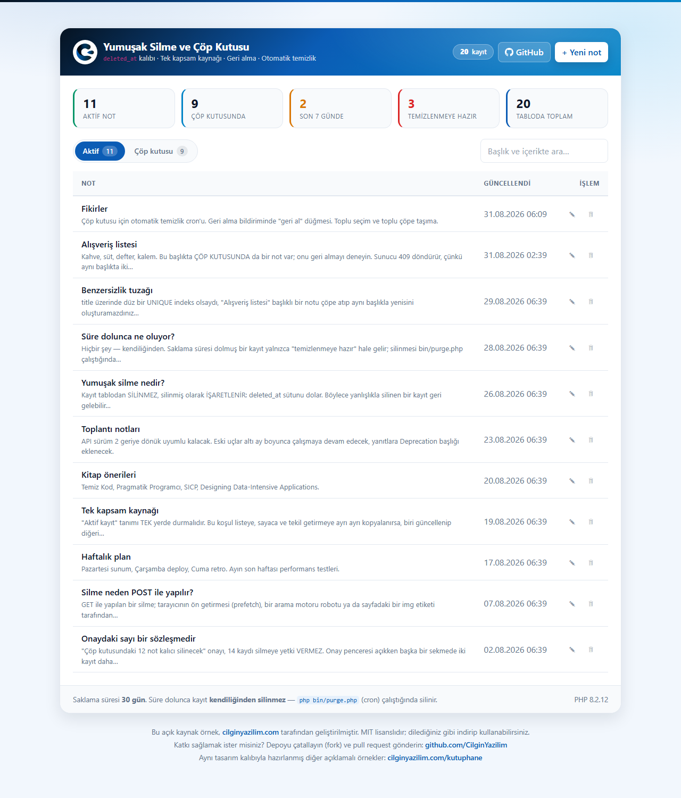
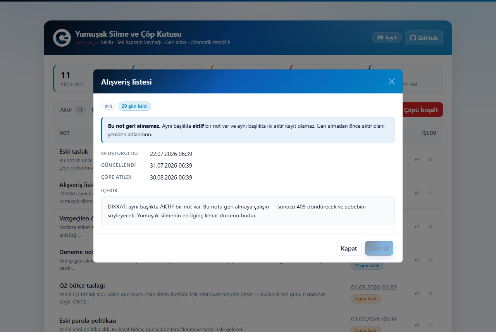
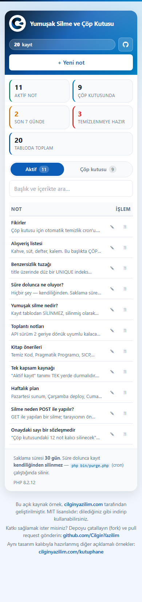

<div align="center">


# Yumuşak Silme ve Çöp Kutusu

### PHP 8 · PDO · MySQL · `deleted_at` Kalıbı · Cron ile Otomatik Temizlik · Çılgın Yazılım Tasarım Kalıbı

**"Sil" düğmesi veriyi yok etmek zorunda değil. Ama yumuşak silmenin de bir bedeli var — bu örnek ikisini de gösteriyor.**

[](https://php.net)
[](https://mysql.com)
[](https://getbootstrap.com)
[](#kurulum)
[](LICENSE)

**🇹🇷 Türkçe** · [🇬🇧 English](README.en.md)

[**▶ Canlı Demo**](https://cilginyazilim.com/kutuphane/uygulama/soft-delete-trash/) · [Kaynak Kütüphanesi](https://cilginyazilim.com/kutuphane/php-soft-delete-trash) · [cilginyazilim.com](https://cilginyazilim.com)

</div>

---

<div align="center">

## Canlı Demo

**Kurulum yok, kayıt yok, indirme yok — tarayıcınızdan 3 saniyede deneyin.**

<a href="https://cilginyazilim.com/kutuphane/uygulama/soft-delete-trash/"></a>
<a href="https://cilginyazilim.com/kutuphane/php-soft-delete-trash"></a>
<a href="https://github.com/CilginYazilim/soft-delete-trash/archive/refs/heads/main.zip"></a>

<br><br>

<a href="https://cilginyazilim.com/kutuphane/uygulama/soft-delete-trash/" title="Canlı demoyu açmak için tıklayın">
  
</a>

<sub>▲ Görsele tıklayarak demoyu açabilirsiniz</sub>

</div>

<br>

### Demoda 60 saniyede neleri deneyebilirsiniz?

| # | Şunu deneyin | Perde arkasında ne oluyor? |
|---|--------------|----------------------------|
| **1** | Bir notun 🗑 düğmesine basın | Kayıt **silinmez**: `deleted_at = NOW()` yazılır. Onay penceresi bunun **geri alınabilir** olduğunu açıkça söyler — kalıcı silmeyle aynı dille konuşmaz |
| **2** | **Çöp kutusu** sekmesine geçin | Aynı uç nokta, aynı kod — farkı yalnızca `view` parametresi. Sunucuda `active_scope()` yerine `trash_scope()` çalışır |
| **3** | Sayaç şeridindeki **Temizlenmeye hazır: 3** kutusuna bakın | Bu üç kaydın saklama süresi doldu ama **hâlâ duruyorlar**. Süre dolunca hiçbir şey kendiliğinden olmaz; silme işi `bin/purge.php`'nindir |
| **4** | Çöpteki **"Alışveriş listesi"** notunu açın | Kırmızı uyarı: *bu not geri alınamaz*. Aynı başlıkta **aktif** bir not var ve "Geri al" düğmesi baştan pasif — 409 hatası almanız beklenmiyor, sebep önceden söyleniyor |
| **5** | Aynı notu listeden ↩ ile geri almayı deneyin | Sunucu **409** döner ve nedenini yazar. Aynı başlıkta iki aktif kayıt olamaz |
| **6** | Aktif listede yeni bir not açıp başlığına **"Fikirler"** yazın | Yine **409**. Ama çöpteki bir notla aynı başlığı kullanabilirsiniz — benzersizlik yalnızca **aktif** kayıtlar arasındadır |
| **7** | Çöpteki bir notu ↩ ile geri alın | `deleted_at = NULL`. Başka hiçbir alana dokunulmaz; `created_at` ve `updated_at` olduğu gibi kalır |
| **8** | **Süresi dolanları temizle** düğmesine basın | Cron'un elle çalıştırılmış hâli. **Aynı** `purge_expired_trash()` fonksiyonunu çağırır; yalnızca 30 günden eski kayıtlar gider |
| **9** | **Çöpü boşalt** deyin, sonra başka bir sekmede bir not daha çöpe atıp onaylayın | **409:** "Liste değişti, işlem yapılmadı." Onaydaki sayı bir süs değil, işlemin **sözleşmesidir** |
| **10** | **Hepsini geri al** deyin | Çakışan başlıklar **atlanır**, kaç tanesinin atlandığı size söylenir. Tek bir çakışma yüzünden 20 kaydın geri alınmaması işinize yaramazdı |
| **11** | Bir satıra tıklayın | Detay penceresi açılır; adres çubuğu `#not-13` olur — **paylaşılabilir**. Bağlantıyla açılan sayfa kayıt çöpteyse o sekmeye kendisi geçer |

> **İpucu:** Demoyu açıkken **F12 → Network** sekmesini açın. Her işlemin `POST` ile gittiğini, CSRF jetonunu taşıdığını ve HTTP durum kodlarını (200 / 403 / 404 / 405 / 409 / 422 / 429) canlı görebilirsiniz.

### Demo alanı hakkında bilinmesi gerekenler

| Konu | Durum |
|------|-------|
| **Veriler** | `cy_trash.sql` içindeki **11 aktif + 9 çöpteki not**. Çöp kutusu bilerek her yaş grubunu temsil eder: yeni silinmiş, son günlerine gelmiş (uyarı rengi) ve süresi dolmuş. |
| **Başlık çakışması** | "Alışveriş listesi" hem aktif hem çöpte bulunur — geri alma çakışmasını görebilmeniz için **bilerek** kuruldu. |
| **Sıfırlama** | Demo veritabanı **düzenli aralıklarla** başlangıç hâline döner; sildiğiniz notlar geri gelir. |
| **Saklama süresi** | **30 gün.** Kalan 7 günün altına düşen kayıtlar uyarı rengine geçer. |
| **Cron** | Demoda gerçek bir arka plan görevi **yoktur**; "Süresi dolanları temizle" düğmesi cron ile aynı fonksiyonu bir kez çalıştırır. |
| **`APP_DEBUG`** | Canlıda **otomatik `false`** — sunucu adından türetilir, yerelde `true` kalır. |
| **Bağımlılık** | **Sıfır.** Composer yok, npm yok. |

> Demo geçici olarak kapalıysa endişelenmeyin: depoyu klonlayıp `cy_trash.sql`'i içe aktarmanız aynı ekranı kendi bilgisayarınızda **2 dakikada** ayağa kaldırır → [Kurulum](#kurulum)

---

## Bu Proje Nedir?

Bir kullanıcı yanlışlıkla "Sil" düğmesine bastı. Kayıt gitti. Yedekten dönmek saatler sürer ve o yedek dünkü hâli getirir.

Çözüm bilinir: **kaydı silme, silinmiş olarak işaretle.** Adı yumuşak silme (soft delete), kalıbı basit: bir `deleted_at` sütunu. Ama basit görünen bu kalıp, uygulamada dört yerde ısırır:

```php
// Sanılan: tek satır yeter
UPDATE notes SET deleted_at = NOW() WHERE id = ?

// Gerçek: artık HER sorguya bir koşul eklemek zorundasınız
SELECT * FROM notes WHERE deleted_at IS NULL          -- listede
SELECT COUNT(*) FROM notes WHERE deleted_at IS NULL   -- sayaçta
UPDATE notes SET ... WHERE id = ? AND deleted_at IS NULL  -- düzenlemede
```

Koşulu **bir yerde unutmak yeter**: kullanıcı çöpe attığını sandığı kaydı hâlâ listede görür, ya da geri aldığı kayıt hiçbir yerde görünmez. Ve bu, sorunun yalnızca ilki:

1. **Koşul üç yere kopyalanırsa?** → tek kapsam kaynağı: `active_scope()` / `trash_scope()`
2. **`title` üzerinde UNIQUE indeks varsa?** → çöpteki kayıt yeni kaydı engeller. Çözüm: **aktif kayıtlar arasında** benzersizlik
3. **Geri alırken aynı başlıkta yeni bir kayıt varsa?** → ham veritabanı hatası değil, açık bir **409**
4. **Çöp kutusu sonsuza dek büyürse?** → saklama süresi + cron ile **otomatik temizlik**
5. **"12 kayıt silinecek" onayı 14'e yetki verir mi?** → hayır: onaydaki sayı sunucuya geri gönderilir
6. **Kalıcı silme ile çöpe taşıma aynı düğme mi?** → hayır: ayrı onay, ayrı renk, ayrı **hız sınırı kovası**

**Kimler için uygun?**

- "Sil"in geri alınabilir olmasını isteyen herkes
- Yumuşak silmeyi ilk kez kuracaklar ve kenar durumlarını önceden görmek isteyenler
- Laravel'in `SoftDeletes` trait'inin **ne yaptığını** merak edenler
- Çöp kutusu, arşiv ya da "geri al" özelliği yazacaklar
- Bootstrap 5 üzerine kurulu, tekrar kullanılabilir bir tasarım kalıbı arayanlar

> **Klonla, `cy_trash.sql`'i içe aktar, çalıştır.** Başka hiçbir kurulum adımı yok. Composer yok, npm yok, internet bağlantısı bile gerekmiyor — tüm kütüphaneler proje içinde.

Bu proje, **[Çılgın Yazılım Kütüphanesi](https://cilginyazilim.com/kutuphane)** altında yayınlanan açıklamalı, üretime hazır örneklerden biridir.

---

## İçindekiler

- [Canlı Demo](#canlı-demo)
- [Bu Proje Nedir?](#bu-proje-nedir)
- [Ekran Görüntüleri](#ekran-görüntüleri)
- [Beş Kritik Karar](#beş-kritik-karar)
- [Neler Var?](#neler-var)
- [Güvenlik: Neyi, Nasıl Kapattık?](#güvenlik-neyi-nasıl-kapattık)
- [Kurulum](#kurulum)
- [Otomatik Temizlik (cron)](#otomatik-temizlik-cron)
- [Yapılandırma](#yapılandırma)
- [Kendi Projenize Eklemek](#kendi-projenize-eklemek)
- [Tasarım Kalıbı](#tasarım-kalıbı)
- [Dosya Yapısı](#dosya-yapısı)
- [Nasıl Çalışıyor?](#nasıl-çalışıyor)
- [API Referansı](#api-referansı)
- [Veritabanı Şeması](#veritabanı-şeması)
- [Sık Sorulanlar](#sık-sorulanlar)
- [Canlı Ortama Alırken](#canlı-ortama-alırken)
- [Sorun Giderme](#sorun-giderme)
- [Yol Haritası](#yol-haritası)
- [Katkı](#katkı)
- [Lisans](#lisans)

---

## Ekran Görüntüleri

### Aktif notlar

Sayaç şeridi, iki sekme ve tek tabloda özet. "Temizlenmeye hazır" sayacı sıfırdan büyükse cron'un işi birikmiş demektir.


### Çöp kutusu

Her kaydın yanında kalan gün. Üç durum, üç renk **ve üç ayrı metin**: `29 gün kaldı`, `5 gün kaldı` (uyarı), `temizlenmeye hazır`.


### Not detayı — geri alma çakışması

Aynı başlıkta aktif bir kayıt varsa "Geri al" **baştan pasiftir** ve sebebi yazılıdır. Kullanıcıyı düğmeye bastırıp 409 göstermek, aynı bilgiyi bir adım geç vermektir.



### Mobil görünüm

390px genişlikte **yatay kaydırma yok**. Tarih sütunu gizlenir; durum rozeti başlığın altına taşınır.



---

## Beş Kritik Karar

### 1. "Aktif kayıt" tanımı tek yerde durur

```php
// TİPİK HATALI KOD — koşul her dosyaya kopyalanmış
$rows  = $db->query("SELECT * FROM notes WHERE deleted_at IS NULL");
$count = $db->query("SELECT COUNT(*) FROM notes");          // ← unutuldu!

// BU PROJEDE — tek kaynak
function active_scope(): string { return 'deleted_at IS NULL'; }
function trash_scope(): string  { return 'deleted_at IS NOT NULL'; }
```

Yukarıdaki "unutuldu" satırı hayali değil, bu kalıbın en sık üretilen hatasıdır: liste 11 kayıt gösterirken sayaç 20 der. Kullanıcı hangisine inanacağını bilmez.

Koşulu bir fonksiyonun arkasına almak, onu **değiştirilebilir** de kılar. Yarın "silinmiş ama arşivlenmemiş" gibi üçüncü bir durum gerekirse, düzeltilecek tek bir yer vardır.

### 2. Benzersizlik yalnızca aktif kayıtlar arasındadır

```sql
-- TİPİK HATALI ŞEMA
UNIQUE KEY (title)
-- "Alışveriş" notunu çöpe attınız. Aynı başlıkla yeni bir not
-- açamıyorsunuz — çöptekiyle çakışıyor. Kullanıcı sebebini anlamaz.

-- BU PROJEDE
is_active TINYINT GENERATED ALWAYS AS
    (CASE WHEN deleted_at IS NULL THEN 1 ELSE NULL END) VIRTUAL,
UNIQUE KEY uq_notes_active_title (title, is_active)
```

Numara şurada: **`NULL` değerler UNIQUE indekste çakışmaz.** Çöpteki her kaydın `is_active` değeri `NULL` olduğu için birbirleriyle de, aktif kayıtla da çakışmazlar. Aktif kayıtların hepsinde değer `1` olduğundan, aralarında yalnızca bir tanesi aynı başlığı taşıyabilir.

Bu, yumuşak silmenin en çok atlanan ayrıntısıdır — ve genellikle üründe, kullanıcı "aynı adı neden kullanamıyorum?" diye sorduğunda fark edilir.

### 3. Geri alma çakışması bir hata değil, bir cevaptır

```php
// TİPİK HATALI KOD — ham veritabanı hatası kullanıcıya çıkar
$db->query("UPDATE notes SET deleted_at = NULL WHERE id = $id");
// → SQLSTATE[23000]: Integrity constraint violation: 1062 Duplicate entry…

// BU PROJEDE — önce sorulur, sonra cevaplanır
$chk = $db->prepare('SELECT id FROM notes WHERE title = :t AND ' . active_scope());
// çakışma varsa → 409 + "Geri almadan önce aktif olanı yeniden adlandırın."
```

Dahası: kullanıcı **düğmeye basmadan önce** öğrenir. Detay penceresi kaydı getirirken çakışmayı da sorar; varsa "Geri al" düğmesi pasif gelir ve sebebi yazar. Bir hatayı önlemek, onu güzelce göstermekten iyidir.

Kontrol ve güncelleme **tek transaction** içinde, `FOR UPDATE` kilidiyle yapılır. Yine de UNIQUE indeksin kendisi son savunma hattı olarak yerinde durur: kontrol ile güncelleme arasına giren bir istek, veritabanı seviyesinde durdurulur.

### 4. Süre dolunca hiçbir şey kendiliğinden olmaz

```php
// SANILAN: "30 gün sonra silinir"
// GERÇEK:  30 gün sonra SİLİNMEYE UYGUN hale gelir.
//          Silme işi cron'undur:
//              15 3 * * *  php /yol/bin/purge.php
```

Bu ayrım arayüze de yansır: rozet "silinecek" değil **"temizlenmeye hazır"** der. Cron kurulmamışsa o kayıtlar sonsuza dek çöpte durur — ve kullanıcıya yanlış bir söz vermiş olmayız.

Arayüzdeki "Süresi dolanları temizle" düğmesi ile `bin/purge.php` **aynı** `purge_expired_trash()` fonksiyonunu çağırır. İki ayrı temizleme kodu yazmak, birini düzeltip diğerini unutmanın kesin yoludur — ve unutulan taraf cron olursa fark hiç görünmez.

### 5. Onaydaki sayı işlemin sözleşmesidir

```php
// İSTEMCİ: kullanıcıya GÖSTERDİĞİ sayıyı geri gönderir
post('empty_trash', { expected_count: lastCount })

// SUNUCU: kendi sayar, tutmuyorsa HİÇBİR ŞEYE DOKUNMAZ
if ($current !== $expected) {
    json_error('Liste değişti. Çöp kutusunda şu an ' . $current . ' not var.', 409);
}
```

"Çöp kutusundaki 12 not kalıcı silinecek" onayı, **14 kaydı silmeye yetki vermez.** Onay penceresi açıkken başka bir sekmede (ya da başka bir kullanıcı tarafından) iki kayıt daha çöpe atılmış olabilir.

Sayım ve silme **aynı transaction** içindedir; ayrı olsalardı ikisi arasında eklenen bir kayıt sayıma girmeden silinirdi.

---

## Neler Var?

<table>
<tr><td width="50%" valign="top">

**Yumuşak silme çekirdeği**
- `deleted_at` kalıbı, tek kapsam kaynağı
- Aktif kayıtlar arasında benzersizlik (üretilen sütun + UNIQUE)
- Geri alma çakışmasında **409** ve önden uyarı
- Kapsam koşulu her `UPDATE`/`DELETE`'in `WHERE`'inde
- Çöpteki kayıt **düzenlenemez** (hem sunucu hem arayüz bilir)
- Kalıcı silme yalnızca çöpteki kayda uygulanır

**Çöp kutusu**
- Kalan gün rozeti; uyarı ve "temizlenmeye hazır" durumları
- Kalan gün **SQL'de** hesaplanır (saat dilimi tuzağı yok)
- Hepsini geri al — çakışanları atlar ve kaçını atladığını söyler
- Süresi dolanları temizle (cron ile **aynı** fonksiyon)
- Çöpü boşalt — `expected_count` sözleşmesiyle

</td><td width="50%" valign="top">

**Otomatik temizlik**
- `bin/purge.php` — cron / Görev Zamanlayıcı betiği
- Web'den çalıştırılamaz: `PHP_SAPI` kontrolü **ve** `.htaccess`
- Tekrar çalıştırmak güvenlidir (silinecek yoksa 0 döner)

**Arayüz ve tasarım**
- Marka kalıbı: gradyan başlıklı kartlar, sayaç şeridi, toast
- Tarayıcının `confirm()` kutusu yerine **markayla uyumlu onay penceresi**
- Onay metni geri alınabilir/alınamaz ayrımını **açıkça** yazar
- Detay penceresi + paylaşılabilir derin bağlantı (`#not-13`)
- Arama (250 ms debounce), başlık ve içerikte
- Çift gönderim koruması, alan bazlı doğrulama hataları
- Mobil: 360px'te **yatay kaydırma yok**
- Renk tek başına anlam taşımaz: rozetlerde renk **ve** metin

</td></tr>
</table>

---

## Güvenlik: Neyi, Nasıl Kapattık?

| Açık | Tipik hatalı kod | Bu projede |
|------|------------------|------------|
| **GET ile silme** | `<a href="sil.php?id=5">` | Yazma işlemleri yalnızca **POST**; `GET` isteği `405` döner |
| **CSRF** | Jeton yok | Oturuma bağlı 32 baytlık jeton, her istekte `hash_equals()` ile doğrulanır |
| **SQL Injection** | Dize birleştirme ile sorgu | Tüm sorgular prepared statement, `EMULATE_PREPARES = false` |
| **`LIKE` joker istismarı** | `LIKE '%$q%'` | `\`, `%` ve `_` kaçışlanır |
| **Kapsam atlaması** | Sahiplik/kapsam PHP'de kontrol edilir | Koşul **her sorgunun** `WHERE`'inde — atlanabilir bir adım değil |
| **Yarış durumu (geri alma)** | Kontrol ve güncelleme ayrı | Tek transaction + `FOR UPDATE`; UNIQUE indeks son savunma hattı |
| **Yarış durumu (boşaltma)** | Sayım ve silme ayrı | Tek transaction + `expected_count` denetimi |
| **Kazayla toplu silme** | Tek onayla her şey gider | Kalıcı silme ayrı kovada (**15 istek / 60 sn**), ayrı onay, ayrı renk |
| **Kaba kuvvet / kötüye kullanım** | Sınır yok | Üç ayrı kova: `read` 180/60sn, `write` 60/60sn, `destroy` 15/60sn |
| **XSS** | `.html()` ile basılan kullanıcı verisi | Sunucuda `e()`, istemcide `esc()`; not gövdesi asla ham basılmaz |
| **Bozuk UTF-8 yanıtı yutar** | `json_encode()` sessizce `false` döner | `JSON_INVALID_UTF8_SUBSTITUTE` |
| **Cron betiğinin web'den çalıştırılması** | Korumasız `bin/` klasörü | `PHP_SAPI !== 'cli'` kontrolü **ve** `bin/.htaccess` — iki katman |
| **Bilgi sızdıran hatalar** | Canlıda SQL metni ekrana basılır | `APP_DEBUG` sunucu adından türetilir; canlıda `false` |
| **Yapılandırma sızıntısı** | `config.php` doğrudan indirilebilir | `system/` **beyaz listedir**: yalnızca `ajax.php` açık |
| **Şema/veri sızıntısı** | `/cy_trash.sql` → HTTP 200 | `.sql`, `.md`, `.json`, `.log`, `.ini`, `.bak`, `.example` kapalı (`README*.md` bilinçli istisna) |
| **Clickjacking** | Başlık yok | `X-Frame-Options: SAMEORIGIN` — görünmez bir çerçevede "Çöpü boşalt" tıklatılamaz |
| **MIME sniffing** | Başlık yok | `X-Content-Type-Options: nosniff` |

---

## Kurulum

**Gereksinimler:** PHP 8.0+ · MySQL 5.7+ / MariaDB 10.3+ · Apache

```bash
# 1) Depoyu alın
git clone https://github.com/CilginYazilim/soft-delete-trash.git
cd soft-delete-trash

# 2) Veritabanını oluşturun (dosya CREATE DATABASE'i kendisi yapar)
mysql -u root -p < cy_trash.sql

# 3) Yerel ayarları oluşturun (isteğe bağlı; varsayılanlar XAMPP'a uyar)
#    En kısa yol — .env:
cp .env.example .env
#    → içindeki DB_* satırlarını doldurun
#
#    Ya da config.local.php:
cp system/config.local.php.example system/config.local.php

# 4) Tarayıcıda açın
#    http://localhost/soft-delete-trash/
```

**Composer yok, npm yok.** jQuery ve Bootstrap dosyaları depoda; internet bağlantısı olmadan da çalışır.

> **Üretilen sütun (generated column) uyarısı:** `is_active` sütunu MySQL **5.7+** ve MariaDB **10.2+** gerektirir. Daha eski bir sunucuda çalışıyorsanız, benzersizliği bir tetikleyici (trigger) ya da uygulama katmanında kurmanız gerekir — ama o durumda yarış durumlarına açık kalırsınız.

### Ortam değişkenleri

Depo kökündeki **`.env`** dosyasına yazın; `system/config.php` dosyasına
hiç dokunmayın:

```bash
cp .env.example .env        # Windows: copy .env.example .env
```

`.env` `.gitignore` içindedir: depoya gönderilmez ve dağıtım (deploy) onu
**silmez**. `system/config.php` ise depoda durur ve her dağıtımda depodaki
sürümle değiştirilir — parolayı oraya yazarsanız hem GitHub'a gider hem de
ilk deploy'da kaybolur.

Dosyayı hiç oluşturmasanız da uygulama çalışır; aşağıdaki varsayılanlar
yerel bir XAMPP kurulumuna göredir.

**Değer arama sırası:** `.env` → sunucunun gerçek ortam değişkeni
(Apache `SetEnv`, systemd…) → buradaki varsayılan.

| Değişken | Varsayılan | Ne işe yarar |
|---|---|---|
| `DB_HOST` | `127.0.0.1` | Veritabanı sunucusu |
| `DB_NAME` | `cy_trash` | Veritabanı adı |
| `DB_USER` | `root` | Kullanıcı |
| `DB_PASS` | *(boş)* | Şifre — **koda yazmayın** |
| `APP_TIMEZONE` | `Europe/Istanbul` | PHP'nin saat dilimi |
| `APP_DEBUG` | *ortamdan* | Hataların ekrana basılıp basılmayacağı |

**`APP_TIMEZONE` neden var?** XAMPP'ın `php.ini` dosyasındaki
`date.timezone`, MySQL'in kullandığı sistem diliminden farklı olabilir.
Test makinesinde PHP `Europe/Berlin`, MySQL `Europe/Istanbul`
kullanıyordu; aynı anı anlatan iki satır bir saat farklı görünüyordu.
Zaman **hesapları** SQL tarafında yapıldığı için doğruydu, ama ekrana
basılan saat kayıyordu. Artık dilim açıkça sabitleniyor — sunucunuz başka
bir bölgedeyse bu değişkeni tanımlamanız yeterli, koda dokunmayın.


---

## Otomatik Temizlik (cron)

Çöp kutusu kendiliğinden boşalmaz. Saklama süresi dolan kayıtları silmek için `bin/purge.php` düzenli olarak çalıştırılır.

**Linux / cron** — her gece 03:15:

```cron
15 3 * * *  php /var/www/soft-delete-trash/bin/purge.php >> /var/log/cy-trash-purge.log 2>&1
```

**Windows Görev Zamanlayıcı:**

```
C:\xampp\php\php.exe C:\xampp\htdocs\soft-delete-trash\bin\purge.php
```

Çıktısı tek satırdır ve günlüğe yazılmaya uygundur:

```
[2026-08-31 03:15:00] cy-trash purge: 3 kayıt silindi (>30 gün), 4 ms
```

- **Tekrar çalıştırmak güvenlidir**: silinecek bir şey yoksa `0` döner.
- **Web'den çalıştırılamaz**: dosyanın başında `PHP_SAPI !== 'cli'` kontrolü **ve** `bin/.htaccess` içinde `Require all denied` vardır. İki katman bilinçlidir: `.htaccess`'in okunmadığı bir sunucuda (nginx) PHP kontrolü çalışır.
- Arayüzdeki **"Süresi dolanları temizle"** düğmesi bu betikle **aynı** fonksiyonu çağırır; cron kurmadan mekanizmayı görmek için vardır.

---

## Yapılandırma

Tüm ayarlar `system/config.php` içindedir. **Veritabanı künyesi oraya yazılmaz** — `system/config.local.php` dosyasına yazılır; o dosya `.gitignore` içindedir, depoya gitmez ve deploy sırasında silinmez.

Bu projede fazladan bir sebep var: `bin/purge.php` **ayrı bir süreçtir** ve aynı yapılandırmayı okur. Künyeyi iki yerde tutmak, birini güncelleyip diğerini unutmanın kesin yoludur — ve unutulan taraf cron olursa temizlik sessizce durur.

| Sabit | Varsayılan | Ne işe yarar |
|-------|-----------|--------------|
| `TRASH_RETENTION_DAYS` | `30` | Çöpteki kayıt kaç gün sonra temizlenmeye uygun olur. |
| `TRASH_WARN_DAYS` | `7` | Kalan gün bunun altına düşünce satır uyarı rengine geçer. |
| `NOTE_TITLE_MAX` / `NOTE_BODY_MAX` | `150` / `5000` | Doğrulama sınırları. |
| `PAGE_SIZE_DEFAULT` / `PAGE_SIZE_MAX` | `50` / `200` | Liste boyutu ve tavanı. |
| `RATE_LIMIT_READ` | `[180, 60]` | Liste ve arama. |
| `RATE_LIMIT_WRITE` | `[60, 60]` | Ekle / güncelle / çöpe at / geri al. |
| `RATE_LIMIT_DESTROY` | `[15, 60]` | Kalıcı silme ve boşaltma — **geri alınamaz**, en dar kova. |
| `APP_DEBUG` | *(otomatik)* | Sunucu adından türetilir; canlı alan adında kendiliğinden kapanır. |

---

## Kendi Projenize Eklemek

### 1. Sütunu ve indeksi ekleyin

```sql
ALTER TABLE urunler
  ADD COLUMN deleted_at DATETIME NULL DEFAULT NULL,
  ADD COLUMN is_active TINYINT GENERATED ALWAYS AS
      (CASE WHEN deleted_at IS NULL THEN 1 ELSE NULL END) VIRTUAL,
  ADD KEY idx_urunler_deleted (deleted_at, id);

-- Benzersiz bir alanınız varsa DÜZ UNIQUE'i kaldırıp bunu koyun:
ALTER TABLE urunler
  DROP INDEX uq_urunler_kod,
  ADD UNIQUE KEY uq_urunler_aktif_kod (kod, is_active);
```

### 2. Kapsamı tek yerden verin

```php
require 'system/function.php';

$rows = $db->query('SELECT * FROM urunler WHERE ' . active_scope())->fetchAll();
```

### 3. Silme yerine işaretleyin

```php
$db->prepare('UPDATE urunler SET deleted_at = NOW() WHERE id = :id AND ' . active_scope())
   ->execute([':id' => $id]);
```

### 4. Temizliği kurun

```php
// Kendi tablonuz için purge_expired_trash()'in bir kopyasını yazın
// ya da tablo adını parametre alacak şekilde genelleştirin.
$silinen = purge_expired_trash($db, TRASH_RETENTION_DAYS);
```

> **Uyarı:** Yumuşak silme, veritabanı seviyesindeki `ON DELETE CASCADE` davranışını **devre dışı bırakır**. Bir ürünü yumuşak sildiğinizde, ona bağlı satırlar öylece kalır. Bunu ya elle (aynı transaction içinde) ya da sorgularınızda ilişkili tablonun kapsamını da kontrol ederek çözmeniz gerekir. Bu, yumuşak silmenin gerçek bedelidir ve her tablo için ödemeye değmeyebilir.

---

## Tasarım Kalıbı

Arayüz, tüm Çılgın Yazılım örneklerinde ortak olan tasarım kalıbını kullanır:

| Dosya | Kapsam | Değiştirilir mi? |
|-------|--------|------------------|
| `assets/css/cilginyazilim.css` | **Marka kalıbı** — kartlar, butonlar, tablolar, rozetler, modal | **Hayır.** Projeler arası ortaktır. |
| `assets/css/style.css` | Yalnızca bu sayfaya özgü parçalar (sayaç şeridi, sekmeler, durum rozetleri) | Evet |

Yükleme sırası: `bootstrap` → `cilginyazilim` → `style`. Renkler doğrudan yazılmaz, CSS değişkenlerinden okunur (`--cy-brand-600`, `--cy-danger` …).

Aynı kalıpla hazırlanmış diğer örnekler: [cilginyazilim.com/kutuphane](https://cilginyazilim.com/kutuphane)

---

## Dosya Yapısı

```
.
├── bin/
│   ├── .htaccess          → klasör web'e TÜMÜYLE kapalı
│   └── purge.php          → cron betiği: süresi dolanları kalıcı siler
├── system/
│   ├── .htaccess          → BEYAZ LİSTE: yalnızca ajax.php açık
│   ├── ajax.php           → 10 uç nokta
│   ├── config.php         → yapılandırma + PDO bağlantısı
│   ├── config.local.php   → (siz oluşturursunuz; .gitignore içinde)
│   ├── config.local.php.example
│   └── function.php       → kapsam kaynağı, CSRF, hız sınırı, temizlik
├── assets/
│   ├── css/               → bootstrap.min · cilginyazilim (marka) · style
│   ├── js/                → jquery · bootstrap.bundle · trash.js
│   └── images/logo.png
├── docs/screenshots/
├── .htaccess              → dizin listeleme kapalı, dosya türü kuralları, güvenlik başlıkları
├── .env.example           → Veritabanı bilgileri (isteğe bağlı) — .gitignore içinde
├── cy_trash.sql           → şema + 11 aktif + 9 çöpteki not (NOW() - INTERVAL ile)
├── index.php              → arayüz (veritabanına dokunmaz)
├── CHANGELOG.md
├── LICENSE
├── README.md
└── README.en.md
```

---

## Nasıl Çalışıyor?

```
                        ┌──────────────────────────────┐
   "Sil" düğmesi  ────>  │  UPDATE SET deleted_at=NOW() │  kayıt DURUYOR
                        └──────────────┬───────────────┘
                                       │
                     ┌─────────────────┴──────────────────┐
                     │                                    │
             ↩ "Geri al"                          ⏳ süre doluyor
                     │                                    │
        ┌────────────┴────────────┐          ┌────────────┴─────────────┐
        │ Aynı başlıkta AKTİF     │          │ deleted_at < NOW()-30gün │
        │ kayıt var mı?           │          │ → "temizlenmeye hazır"   │
        └────────────┬────────────┘          └────────────┬─────────────┘
              ┌──────┴──────┐                             │
             yok           var                            │
              │             │                             │
   deleted_at=NULL      409 döner                 bin/purge.php (cron)
      (geri alındı)   "önce yeniden                        │
                       adlandırın"                  DELETE — geri alınamaz


   HER SORGUDA:   active_scope()  →  deleted_at IS NULL
                  trash_scope()   →  deleted_at IS NOT NULL
                  ↑ tek kaynak; listede, sayaçta, güncellemede aynısı
```

**Sıra bilinçlidir.** Çakışma kontrolü geri alma işleminden **önce** ve aynı transaction içinde yapılır. Kalıcı silme ise yalnızca çöpteki kayda uygulanır: "önce çöpe at" adımı zorunludur, yoksa yumuşak silmenin varlık sebebi ortadan kalkardı.

---

## API Referansı

Tüm uçlar `system/ajax.php` altındadır, **POST** ister ve CSRF jetonu taşır.

Yanıt biçimi:

```jsonc
// Başarılı
{ "success": true, "type": "success", "description": "Not geri alındı." }

// Hatalı
{ "success": false, "type": "danger", "description": "…", "errors": { "title": "…" } }
```

<details>
<summary><b>list</b> — aktif veya çöp listesi</summary>

| Parametre | Varsayılan | Not |
|-----------|-----------|-----|
| `view` | `active` | `active` \| `trash` |
| `search` | — | Başlık ve içerikte arar; `%` ve `_` kaçışlanır |
| `limit` | `50` | En çok `200` |

```json
{
  "success": true, "view": "trash", "count": 9, "retention_days": 30, "warn_days": 7,
  "rows": [
    { "id": 16, "title": "Q2 bütçe taslağı", "excerpt": "Yerini Q3 taslağı aldı…",
      "updated": "06.08.2026 06:39", "deleted": "06.08.2026 06:39",
      "days_left": 5, "is_expired": false }
  ]
}
```

`days_left` ve `is_expired` **SQL'de** hesaplanır: PHP'nin ve MySQL'in saat dilimi eşit olmak zorunda değildir, ve `deleted_at` MySQL'in `NOW()` değeriyle yazılmıştır.
</details>

<details>
<summary><b>stats</b> — sayaç şeridi</summary>

```json
{ "success": true,
  "stats": { "aktif": 11, "copte": 9, "son_gunler": 2, "suresi_dolan": 3, "toplam": 20 } }
```

Beş sayı **tek sorgudan** gelir. Beş ayrı `COUNT` yazmak beş ayrı anlık görüntü demektir; sorgular arasında bir kayıt çöpe taşınırsa toplamlar birbirini tutmaz ve ekranda imkânsız bir satır belirir.
</details>

<details>
<summary><b>fetch</b> — tek kayıt (detay penceresi)</summary>

Çöpteki kayıt da getirilebilir — kullanıcı geri almadan önce içine bakabilmeli. Ama `editable: false` gelir ve `save` zaten aktif kapsam dışına yazmaz. Kural iki yerde birden durur.

```json
{ "success": true, "note": {
    "id": 13, "title": "Alışveriş listesi", "body": "…",
    "created": "22.07.2026 06:39", "updated": "31.07.2026 06:39", "deleted": "30.08.2026 06:39",
    "in_trash": true, "editable": false, "days_left": 29, "is_expired": false,
    "can_restore": false } }
```

`can_restore: false` → aynı başlıkta aktif bir kayıt var. Arayüz düğmeyi baştan pasifleştirir.
</details>

<details>
<summary><b>save</b> — ekle / güncelle</summary>

`id = 0` ise ekler, değilse günceller. Güncelleme **yalnızca aktif** kayda uygulanır.

| Durum | Ne zaman |
|-------|----------|
| `422` | Başlık 2-150 karakter değil ya da içerik 5000'i aşıyor (`errors` alan adıyla gelir) |
| `409` | Aynı başlıkta **aktif** bir not var |
| `404` | Kayıt yok ya da çöpte |

Çakışma **indeks adına bakarak** ayırt edilir (`uq_notes_active_title`); yalnızca `23000` koduna bakmak yetmez, aynı kod başka kısıt ihlallerinde de gelir.
</details>

<details>
<summary><b>soft_delete</b> / <b>restore</b> / <b>restore_all</b></summary>

- **`soft_delete`** → `deleted_at = NOW()`. Kapsam koşulu `UPDATE`'in `WHERE`'indedir; zaten çöpteyse `404`.
- **`restore`** → `deleted_at = NULL`. Çakışma varsa **409** ve `conflict_id`. Kontrol + güncelleme tek transaction, `FOR UPDATE` kilidiyle.
- **`restore_all`** → çakışanları **atlar**, kaçının atlandığını söyler:

```json
{ "success": true, "restored": 8, "skipped": 1,
  "description": "8 not geri alındı. 1 not, aynı başlıkta aktif bir kayıt olduğu için atlandı." }
```

"Hepsi ya da hiçbiri" burada yanlış olurdu: tek bir çakışma yüzünden 20 kaydın geri alınmaması kullanıcının işine yaramaz.
</details>

<details>
<summary><b>delete_forever</b> / <b>empty_trash</b> / <b>purge_expired</b></summary>

Üçü de `destroy` kovasındadır (**15 istek / 60 sn**) — geri alınamaz işlemler ayrı bir sınırla korunur.

- **`delete_forever`** → yalnızca **çöpteki** kayda uygulanır. Aktif bir kayda denenirse `404` ve "önce çöpe taşıyın".
- **`empty_trash`** → `expected_count` **zorunludur**. Sunucunun saydığıyla tutmuyorsa `409` ve hiçbir şey silinmez.
- **`purge_expired`** → yalnızca `TRASH_RETENTION_DAYS`'ten eski kayıtları siler. `bin/purge.php` ile **aynı** fonksiyonu çağırır.
</details>

---

## Veritabanı Şeması

```sql
notes
├── id          INT UNSIGNED  AUTO_INCREMENT (214'ten başlar)
├── title       VARCHAR(150)
├── body        TEXT
├── created_at  TIMESTAMP
├── updated_at  TIMESTAMP  ON UPDATE CURRENT_TIMESTAMP
├── deleted_at  DATETIME NULL      ← NULL = aktif, dolu = çöpte
├── is_active   TINYINT GENERATED ALWAYS AS
│                 (CASE WHEN deleted_at IS NULL THEN 1 ELSE NULL END) VIRTUAL
├── UNIQUE KEY uq_notes_active_title (title, is_active)
├── KEY idx_notes_deleted (deleted_at, id)
└── KEY idx_notes_active_updated (is_active, updated_at)
```

| Karar | Neden |
|-------|-------|
| `deleted_at`, `is_deleted` değil | Bir bayrak yalnızca "silindi mi?" der. Tarih ayrıca **ne zaman** silindiğini söyler — saklama süresi hesabı buna dayanır ve bayrakla mümkün olmaz. |
| `DATETIME`, `TIMESTAMP` değil | `TIMESTAMP`'in üst sınırı 2038'dir ve oturum saat dilimine göre dönüştürülür. `deleted_at` bir olay anıdır; `DATETIME` sürprizsizdir. |
| `is_active` **VIRTUAL** | Değer diskte tutulmaz, indeks için okunurken hesaplanır. Sütuna hiç bakmıyoruz; yalnızca UNIQUE indeksin varlık sebebi. |
| `UNIQUE (title, is_active)` | Benzersizliği **aktif** kayıtlarla sınırlar. `NULL`'lar UNIQUE indekste çakışmadığı için çöpteki kayıt yolu tıkamaz. |
| `idx_notes_deleted (deleted_at, id)` | Liste sorgusu `deleted_at` ile filtreler, `id`/`deleted_at` ile sıralar; tek indeks ikisini birden karşılar. |
| `AUTO_INCREMENT = 214` | Bu uygulamada kayıt **gerçekten** silinir (kalıcı silme ve purge); numaralar boşalır. Yeni bir kayıt silinmiş bir numarayı devralırsa `#not-42` bağlantısı yanlış kayda gider. |

---

## Sık Sorulanlar

<details>
<summary><b>Yumuşak silme her tabloda kullanılmalı mı?</b></summary>

Hayır. Bedeli gerçektir: her sorguya bir koşul eklersiniz, `ON DELETE CASCADE` devre dışı kalır, benzersizlik kısıtlarını yeniden düşünmeniz gerekir ve tablo sürekli büyür.

Kârlı olduğu yerler: kullanıcının kendi ürettiği ve yanlışlıkla silebileceği veriler (notlar, dosyalar, müşteri kayıtları). Kârsız olduğu yerler: günlük tabloları, oturum kayıtları, önbellek satırları, çoktan-çoğa ara tabloları.

Kural: **geri alınması bir insanı rahatlatacaksa** yumuşak silin.
</details>

<details>
<summary><b>Neden `is_deleted` bayrağı değil de tarih?</b></summary>

Bir bayrak yalnızca "silindi mi?" sorusunu cevaplar. Tarih ayrıca **ne zaman** silindiğini söyler ve bu olmadan saklama süresi hesaplanamaz: "30 gün sonra temizle" kuralını `is_deleted = 1` ile yazamazsınız.

Ayrıca tarih, bayrağın yaptığı her şeyi zaten yapar: `deleted_at IS NULL` bir bayrak kadar hızlı ve indekslenebilir bir koşuldur.
</details>

<details>
<summary><b>Çöp kutusu sonsuza dek büyür mü?</b></summary>

Cron kurulmazsa evet — ve bu, yumuşak silmenin en sık atlanan sonucudur. `bin/purge.php` düzenli çalıştığında tablo kendiliğinden dengelenir.

Arayüzdeki "Temizlenmeye hazır" sayacı bu yüzden var: sıfırdan büyük kalıyorsa cron çalışmıyordur.
</details>

<details>
<summary><b>Yabancı anahtarlar ve `ON DELETE CASCADE` ne olacak?</b></summary>

Yumuşak silme onları **devre dışı bırakır**: satır gerçekten silinmediği için cascade hiç tetiklenmez. Bir kategoriyi yumuşak sildiğinizde ürünleri öylece kalır ve sorgularınız onları göstermeye devam eder.

İki seçenek var: ilişkili kayıtları **aynı transaction içinde** birlikte yumuşak silmek, ya da sorgularda üst kaydın kapsamını da kontrol etmek (`JOIN … AND k.deleted_at IS NULL`). Bu örnek tek tablo üzerinden anlattığı için o karmaşıklığa girmiyor; kendi projenizde ilk düşüneceğiniz şey bu olmalı.
</details>

<details>
<summary><b>Laravel'in SoftDeletes trait'i ile aynı şey mi?</b></summary>

Aynı kalıp, evet. Laravel `deleted_at` sütununu kullanır ve global bir kapsam (global scope) ekleyerek koşulu her sorguya kendisi koyar.

Fark şurada: bu örnekte kapsamı **siz** koyarsınız (`active_scope()`), yani ne olduğunu görürsünüz. Laravel'de `withTrashed()` demeyi unutmak, burada koşulu yazmayı unutmakla aynı sonucu verir — sihir, sorunu ortadan kaldırmaz, yalnızca görünmez kılar.
</details>

<details>
<summary><b>Aynı başlıkta iki not neden olamıyor?</b></summary>

Bu örnekte bilinçli bir kısıt: benzersizlik kuralı olan bir alanın yumuşak silmeyle nasıl çakıştığını göstermek için. Gerçek bir not uygulamasında başlıklar genellikle benzersiz olmak zorunda değildir.

Kendi projenizde bu kısıt gerekmiyorsa `uq_notes_active_title` indeksini kaldırın; kalan her şey aynen çalışır.
</details>

<details>
<summary><b>Kayıt "silindi" ama kullanıcı verisi hâlâ duruyor — KVKK/GDPR?</b></summary>

Önemli bir nokta. Yumuşak silme, veriyi **saklamaya devam etmek** demektir. Kişisel veri söz konusuysa saklama süresi bir hukuki gerekliliktir, bir tercih değil.

Bu örnekte `TRASH_RETENTION_DAYS` ve `bin/purge.php` tam olarak bunun içindir: silme talebi belirli bir süre sonra **gerçekten** yerine getirilir. Cron'un çalıştığından emin olun; çalışmıyorsa "sildik" demeniz doğru olmaz.
</details>

---

## Canlı Ortama Alırken

- [ ] `system/config.local.php` oluşturuldu; canlı veritabanı künyesi orada
- [ ] **Cron kuruldu** ve çalıştığı doğrulandı (`bin/purge.php` günlüğüne bakın)
- [ ] `TRASH_RETENTION_DAYS` sizin için doğru mu? (kişisel veri varsa hukuki süreye bakın)
- [ ] `APP_DEBUG` kapalı (canlı alan adında kendiliğinden kapanır — yine de doğrulayın)
- [ ] `RATE_LIMIT_*` değerleri trafiğinize göre ayarlandı
- [ ] `/cy_trash.sql`, `/system/config.php`, `/bin/purge.php` adresleri **403** dönüyor
- [ ] `/README.md` **200** dönüyor (vitrin için) ama `/CHANGELOG.md` **403**
- [ ] HTTPS açık; oturum çerezi `secure` bayrağını kendiliğinden alacak
- [ ] Yedekleme planı: yumuşak silme yedek yerine geçmez

---

## Sorun Giderme

| Belirti | Sebep | Çözüm |
|---------|-------|-------|
| Arama kutusu hiçbir şey bulmuyor, `500` dönüyor | Aynı adlı yer tutucu iki kez kullanılmış | `EMULATE_PREPARES = false` iken ad tekrar edemez; `:q1`, `:q2` diye ayırın |
| `SQLSTATE[HY000]: ... generated column` | MySQL 5.6 ya da MariaDB 10.1 | Üretilen sütun 5.7+ / 10.2+ gerektirir |
| Çöpteki notu geri alamıyorum | Aynı başlıkta aktif bir not var | Aktif olanı yeniden adlandırın; detay penceresi bunu zaten söylüyor |
| Çöp kutusu hiç boşalmıyor | Cron kurulu değil | `bin/purge.php`'yi zamanlayıcıya ekleyin |
| Türkçe karakterler bozuk | `.sql` yanlış karakter setiyle içe aktarıldı | `mysql --default-character-set=utf8mb4 < cy_trash.sql` |
| `403` "Oturum doğrulaması başarısız" | Oturum düştü ya da CSRF jetonu eski | Sayfayı yenileyin |
| Sürekli `429` | Hız sınırı sayaç dosyaları | `sys_get_temp_dir()/cy_trash_rate` klasörünü silin |
| Liste ile sayaç farklı sayı gösteriyor | Kapsam koşulu bir yerde unutulmuş | `active_scope()` / `trash_scope()` dışında elle yazılmış koşul aramayın — ekleyin |

---

## Yol Haritası

- [ ] Toplu seçim ve toplu çöpe taşıma
- [ ] "Geri al" bildirimi (silme sonrası 10 saniyelik geri alma kutusu)
- [ ] İlişkili tablolarla birlikte yumuşak silme örneği (cascade karşılığı)
- [ ] Kim sildi bilgisi (`deleted_by`) — çok kullanıcılı kurulumlar için
- [ ] Sayfalama (şu an tavan `limit`)
- [ ] Çöp kutusu için ayrı saklama süreleri (tablo başına)

---

## Katkı

Katkılar memnuniyetle karşılanır.

1. Depoyu çatallayın (fork)
2. Bir dal açın: `git checkout -b ozellik/harika-sey`
3. Değişikliklerinizi işleyin: `git commit -m 'Harika şey eklendi'`
4. Dalı gönderin: `git push origin ozellik/harika-sey`
5. Pull request açın

Hata bildirimi ve öneriler için [Issues](https://github.com/CilginYazilim/soft-delete-trash/issues) bölümünü kullanabilirsiniz.

---

## Lisans

MIT — bkz. [LICENSE](LICENSE). Ticari projelerde de özgürce kullanabilirsiniz.

---

<div align="center">

**[Çılgın Yazılım](https://cilginyazilim.com)** · [Kütüphane](https://cilginyazilim.com/kutuphane) · [GitHub](https://github.com/CilginYazilim)

Bu örneği faydalı bulduysanız ⭐ vermeyi unutmayın.

</div>
